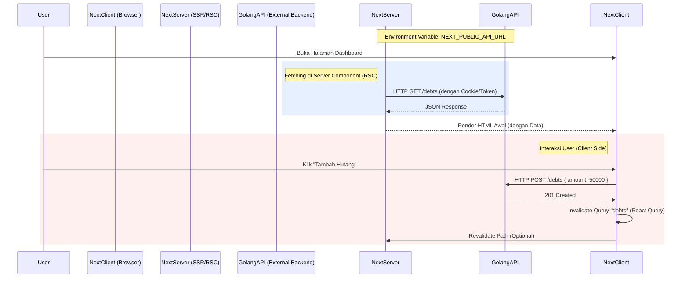

# Arsitektur Proyek UtangHub (Frontend Only)

Dokumen ini diperbarui untuk mencerminkan fokus proyek sebagai **Aplikasi Frontend Next.js Standalone** yang akan mengonsumsi **External REST API (Golang)**.

## 1. Tech Stack (Frontend Only)

Kami menggunakan set teknologi terkini yang mendukung performa, skalabilitas code, dan Developer Experience terbaik.

*   **Framework:** **Next.js 15** (App Router).
*   **Language:** **TypeScript** (Strict Mode).
*   **Styling:** **Tailwind CSS v3/v4**.
*   **Component Library:** **Shadcn UI** (Radix Primitives + Tailwind).
    *   *Alasan:* Memberikan kontrol penuh atas kode komponen sambil tetap memiliki aksesibilitas tinggi.
*   **State Management:**
    *   **Server State:** **TanStack Query (React Query) v5**.
        *   *Sangat Krucial:* Karena backend terpisah (Golang), kita butuh management data fetching yang kuat (caching, invalidation, optimistic updates) di client.
    *   **Client State:** **Zustand** (untuk ui state global yang simple) atau **Nuqs** (URL-based state management).
*   **Form Handling:** **React Hook Form** + **Zod** (Validasi schema).
*   **Data Fetching:** **Ky** atau **Axios** (HTTP Client).

## 2. Struktur Direktori (Feature-Based Architecture)

Karena ini bukan Monorepo, kita menggunakan struktur **Feature-Based**. Ini jauh lebih skalabel daripada struktur grouping by file type (components/hooks/services) biasa. Kode yang berhubungan dengan fitur tertentu (misal: `transactions`) berkumpul di satu folder, bukan tersebar.

```text
.
├── src/
│   ├── app/                    # Next.js App Router (Hanya untuk Routing & Page Layout)
│   │   ├── (auth)/             # Route Group: Login, Register
│   │   ├── (dashboard)/        # Route Group: Dashboard Layout
│   │   │   ├── transactions/
│   │   │   │   └── page.tsx
│   │   │   └── page.tsx
│   │   ├── global-error.tsx
│   │   ├── layout.tsx
│   │   └── page.tsx
│   │
│   ├── components/             # Shared / Generic UI Components (Atomic)
│   │   ├── ui/                 # Shadcn Components (Button, Input, Card)
│   │   └── ...
│   │
│   ├── features/               # LOGIC BISNIS DISINI (Slice per fitur)
│   │   ├── auth/               # Fitur Authentication
│   │   │   ├── components/     # - LoginForm.tsx, RegisterForm.tsx
│   │   │   ├── api/            # - useLogin.ts, useRegister.ts (React Query Hooks)
│   │   │   └── types/          # - auth.types.ts
│   │   │
│   │   ├── debts/              # Fitur Hutang/Transaksi
│   │   │   ├── components/     # - DebtList.tsx, AddDebtModal.tsx
│   │   │   ├── hooks/          # - useDebtCalculator.ts
│   │   │   ├── api/            # - useGetDebts.ts, useCreateDebt.ts
│   │   │   └── types/          # - debt.dto.ts
│   │   │
│   │   └── friends/            # Fitur Teman
│   │
│   ├── lib/                    # Shared configurations & utilitas
│   │   ├── api-client.ts       # Config Axios/Ky instance (Base URL, Interceptors)
│   │   ├── utils.ts            # CN helper for Tailwind
│   │   └── constants.ts
│   │
│   ├── hooks/                  # Global hooks (useMediaQuery, useDebounce)
│   └── types/                  # Global Types / API Response Wrappers
│
├── public/
├── next.config.ts
└── tailwind.config.ts
```

### Mengapa Feature-Based?
*   **Maintainability:** Saat fitur "Hutang" error, Anda hanya perlu melihat folder `features/debts`.
*   **Scalability:** Menambah fitur baru = menambah folder baru di `features/`. Tidak ada file raksasa `components` yang bercampur aduk.

## 3. Alur Data (Consuming Golang API)

Karena Backend (Golang) terpisah, kita harus memastikan kontrak API jelas.



### Strategi Integrasi API:
1.  **Code Generator (Rekomendasi):** Jika backend Golang menggunakan Swagger/OpenAPI, kita bisa generate TypeScript Types otomatis menggunakan tools seperti `openapi-typescript-codegen`. Ini menjaga sinkronisasi tipe data.
2.  **Manual Types:** Jika tidak, kita buat interface manual di folder `features/xxx/types`.

### Authentication Flow:
Disarankan menggunakan **HTTP-Only Cookies** untuk menyimpan JWT/Session Token.
1.  Frontend POST `/login`.
2.  Backend Golang set cookie `Set-Cookie: token=xyz; HttpOnly`.
3.  Setiap request selanjutnya, browser/Next.js otomatis membawa cookie tersebut ke Golang API (jika domain sama atau dikonfigurasi CORS + Credentials dengan benar).

---
**Langkah Selanjutnya:**
1.  Setup Next.js project di root.
2.  Setup Tailwind & Shadcn.
3.  Setup struktur folder `features`.
